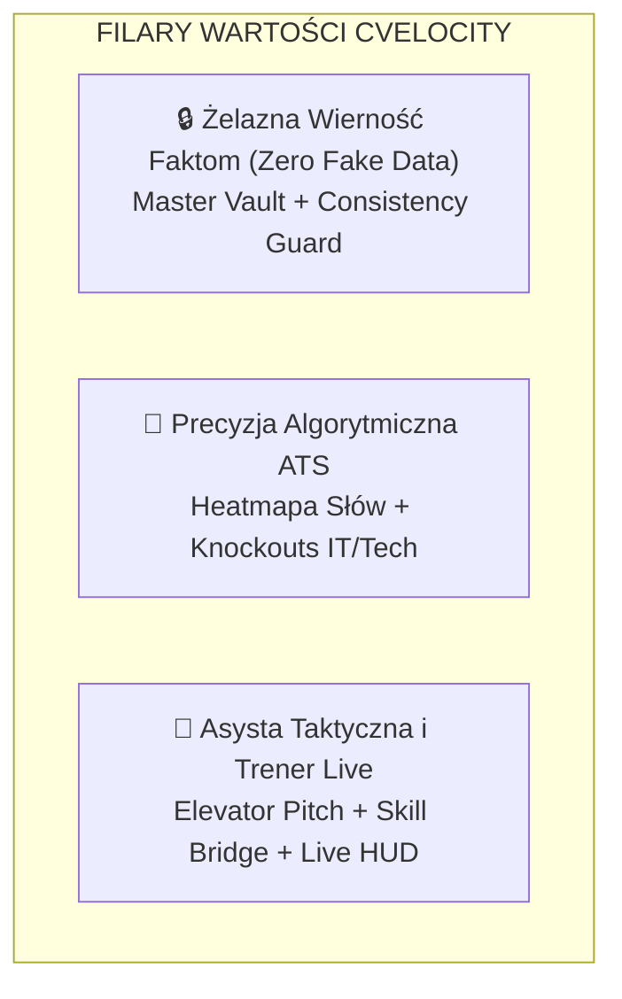
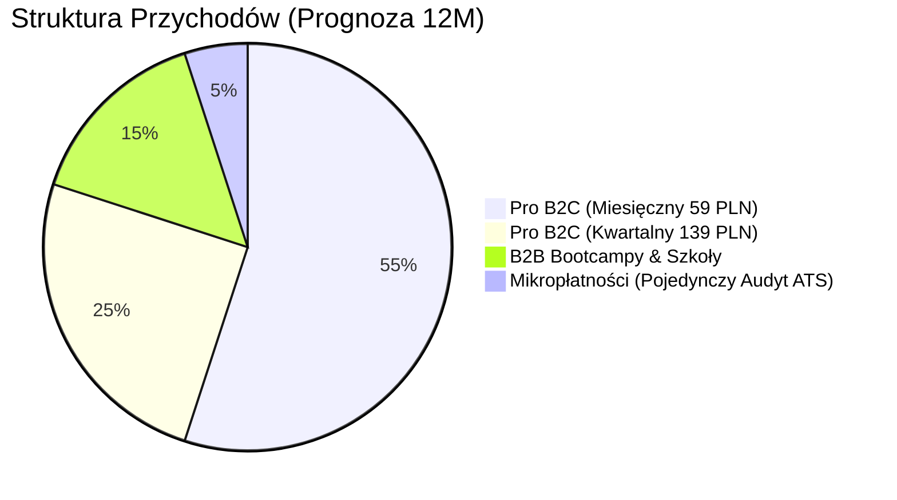
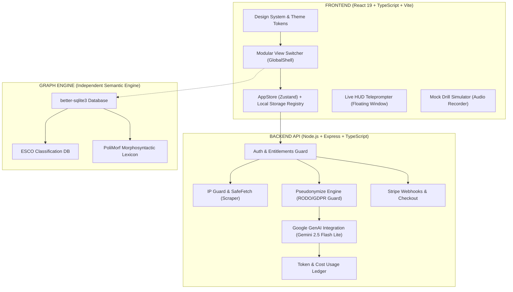
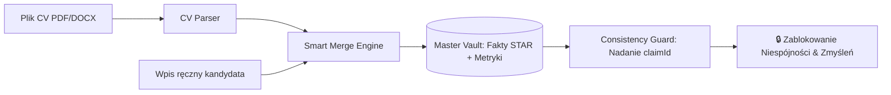
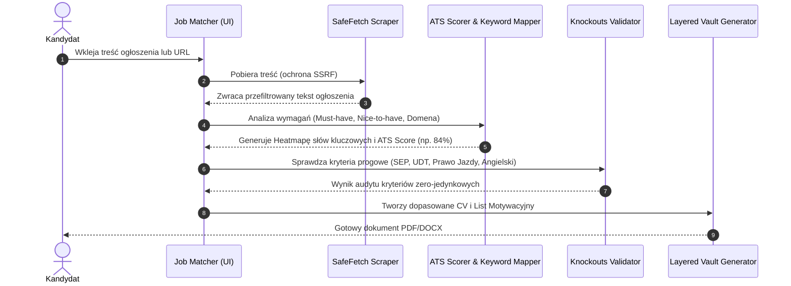
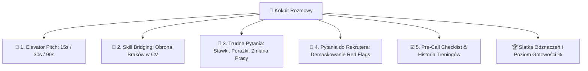
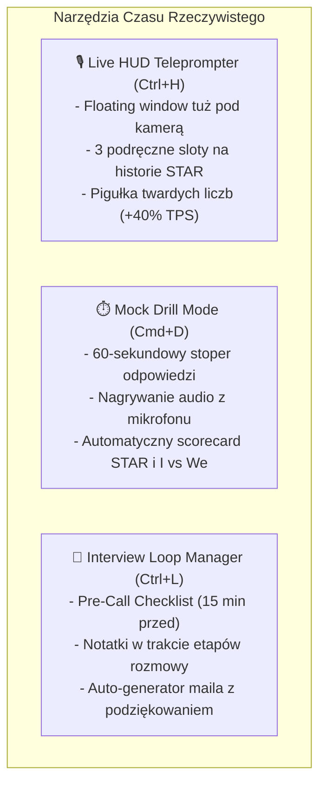
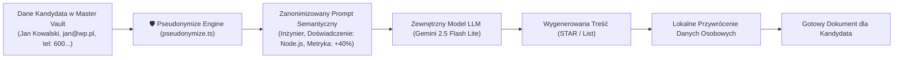
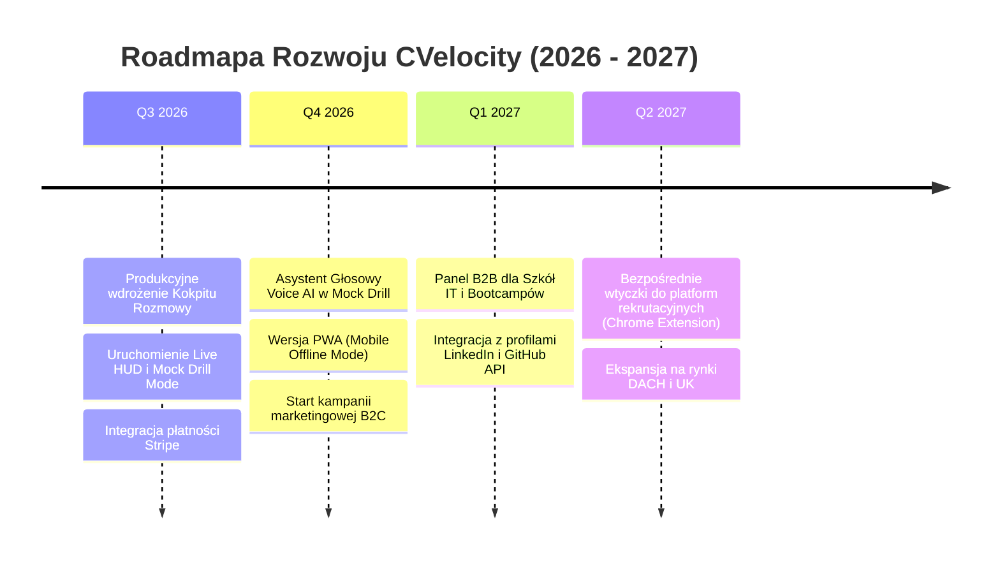

# 📘 CVELOCITY — Kompleksowy Raport Projektowy, Architektoniczny, Biznesowy i Audytowy
> **Dokumentacja Audytowa & Strategiczna Systemu**  
> **Wersja:** 2.0 (Tactical Career OS, ATS Intelligence & Real-Time Teleprompter)  
> **Status:** Produkcyjny / Gotowy do Skalowania Komercyjnego  
> **Data wydania:** Sierpień 2026  
> **Adres produkcyjny:** [https://cvelocity.oathcry.com/](https://cvelocity.oathcry.com/)  
> **Autorzy:** Zespół Inżynierii & Produktu CVelocity  

---

## 📑 Spis Treści
1. [Wprowadzenie i Diagnoza Rynku Rekrutacji](#1-wprowadzenie-i-diagnoza-rynku-rekrutacji)
2. [Wizja Produktu i Unikalna Propozycja Wartości (USP)](#2-wizja-produktu-i-unikalna-propozycja-wartości-usp)
3. [Model Biznesowy, Monetyzacja i Strategia Go-To-Market (GTM)](#3-model-biznesowy-monetyzacja-i-strategia-go-to-market-gtm)
   - 3.1. Grupy Docelowe i Matryca Person (B2C & B2B)
   - 3.2. Lejek Konwersji i Akwizycji (Viral Growth Loops)
   - 3.3. Struktura Cennika i Wskaźniki Finansowe (Unit Economics)
4. [Architektura Systemowa i Nawigacja UI/UX](#4-architektura-systemowa-i-nawigacja-uiux)
   - 4.1. Architektura Hybrydowa (React 19 + Node.js + SQLite Semantic Engine)
   - 4.2. Mapa Nawigacji i Ergonomia Interfejsu (Design System & Shortcuts)
5. [Szczegółowy Opis Wszystkich Bloków Funkcjonalnych](#5-szczegółowy-opis-wszystkich-bloków-funkcjonalnych)
   - 5.1. Blok 1: Źródło Prawdy o Kandydacie (Master Vault & Consistency Guard)
   - 5.2. Blok 2: Dopasowanie Ofert i Silnik ATS (Job Matcher & Knockouts)
   - 5.3. Blok 3: Centrum Edukacyjno-Taktyczne (Kokpit Rozmowy & Playbook)
   - 5.4. Blok 4: Narzędzia Live & Pilotaż Spotkania (HUD, Mock Drill, Loop Manager)
   - 5.5. Blok 5: CRM Aplikacji, Monetyzacja & Zarządzanie Subskrypcją
   - 5.6. Blok 6: Graf Semantyczny Profesji (Semantic Work Graph Engine)
6. [Bezpieczeństwo, RODO i Polityka Prywatności (Privacy by Design)](#6-bezpieczeństwo-rodo-i-polityka-prywatności-privacy-by-design)
7. [Szczegółowa Analiza Konkurencji (Competitive Landscape)](#7-szczegółowa-analiza-konkurencji-competitive-landscape)
8. [Bramka Jakości Kodu i Wyniki Testów Automatycznych](#8-bramka-jakości-kodu-i-wyniki-testów-automatycznych)
9. [Długofalowa Mapa Drogowa (Roadmap 2026/2027)](#9-długofalowa-mapa-drogowa-roadmap-20262027)

---

## 1. Wprowadzenie i Diagnoza Rynku Rekrutacji

Rynek rekrutacji w latach 2024–2026 przeszedł bezprecedensową transformację. Powszechność generatywnej sztucznej inteligencji doprowadziła do zalewu pracodawców tysiącami nijakich, automatycznie wygenerowanych aplikacji. W odpowiedzi na to zjawisko, działy HR i agencje rekrutacyjne wdrożyły zaawansowane filtry **ATS (Applicant Tracking Systems)** oraz bardziej rygorystyczne etapy techniczne.

### Kluczowe Patologie Współczesnego Rynku Pracy:
1. **Zjawisko „Halucynacji Rekrutacyjnych”**:
   Typowe generatory CV oparte na surowych modelach LLM (ChatGPT, generyczne resume-buildery) bezrefleksyjnie dopisują technologie, których kandydat nigdy nie widział na oczy. Efekt: kandydat przechodzi wstępną selekcję, ale kompromituje się na pierwszym pytaniu technicznym.
2. **Czarna Dziura Systemów ATS**:
   Ponad **75% aplikacji** zostaje automatycznie odrzuconych przed przeczytaniem przez człowieka. Przyczynami są: brak precyzyjnych słów kluczowych w odpowiednim kontekście semantycznym oraz niespełnienie twardych kryteriów brzegowych (*Knockouts*).
3. **Paraliż Taktyczny na Rozmowie Kwalifikacyjnej**:
   Większość kandydatów nie odpada z braku wiedzy, lecz z braku taktyki:
   - Na pytanie *„Opowiedz o sobie”* streszczają całe studia i dzieciństwo zamiast podać 30-sekundowy pitch biznesowy z twardą metryką.
   - Gdy rekruter pyta o brakujące narzędzie (np. brak AWS u programisty GCP lub brak TIG u spawacza MIG), kandydat milczy lub kłamie, zamiast zastosować *most kompetencyjny* (*Skill Bridging*).
   - Kandydaci zbyt wcześnie podają zaniżone stawki i nie potrafią zadać pytań demaskujących dług technologiczny i toksyczną kulturę organizacji (*Red Flags*).

---

## 2. Wizja Produktu i Unikalna Propozycja Wartości (USP)

**CVelocity** to **Taktyczny System Operacyjny Kariery (Career Tactical OS)**. Zamiast kolejnego szablonu graficznego w PDF, dostarcza inżynierski system zarządzania karierą oparty na trzech żelaznych filarach:



### Unikalna Wartość Rynkowa (USP):
- **100% Prawdy i Spójności (`claimId`)**: Żadne słowo w CV ani w podpowiedziach live nie jest zmyślone. System pobiera wyłącznie fakty zweryfikowane w *Master Vault*.
- **Wielobranżowość (Reguła 8)**: System od pierwszego dnia projektowany był z myślą nie tylko o IT, ale także o inżynierach automatykach, monterach, spawaczach i technikach (uwzględnia uprawnienia SEP, UDT, F-Gazy, prawo jazdy).
- **Asysta w Czasie Rzeczywistym (Real-Time Live HUD)**: Pływający teleprompter na ekranie podczas rozmów wideo (Google Meet / Zoom / MS Teams), który wyświetla kluczowe liczby i historie STAR tuż pod okiem kamery.

---

## 3. Model Biznesowy, Monetyzacja i Strategia Go-To-Market (GTM)

### 3.1. Grupy Docelowe i Matryca Person

| Persona | Profil & Wyzwanie | Kluczowa Funkcja CVelocity | Gotowość do Płacenia |
|---|---|---|---|
| **Kandydat Tech / IT (Mid/Senior/Lead)** | Wysokie stawki (18k–35k PLN), duża konkurencja, skomplikowane pytania architektoniczne i system design. | *Live HUD*, *Skill Bridging* (obrona luk technologicznych), *Pytania Red Flags*. | **BARDZO WYSOKA** (zwrot z inwestycji po 1 dniu nowej pracy). |
| **Inżynier / Specjalista Techniczny (Blue-Collar Pro)** | Automatyk, elektryk, spawacz, monter, logistyk. Wymóg twardych certyfikatów i licencji. | *Knockout Auditor* (SEP, UDT), audyt uprawnień, szybkie dopasowanie mobilne. | **ŚREDNIA / WYSOKA** (zależy od szybkości znalezienia zlecenia). |
| **Junior / Switcher po Bootcampie** | Brak bogatego doświadczenia, luki w technologiach z ogłoszenia, stres przed rozmową. | *Elevator Pitch 30s*, *Mock Drill Mode* (60s treningi), *Mosty Kompetencyjne*. | **WYSOKA** (inwestycja w wejście do branży). |
| **Instytucje Edukacyjne & Bootcampy (B2B)** | Potrzeba wykazania wysokiego wskaźnika zatrudnialności swoich absolwentów. | Licencje grupowe, standaryzacja jakości CV absolwentów, dashboard postępów. | **B2B CONTRACTS** (abonament roczny / per seat). |

---

### 3.2. Lejek Konwersji i Akwizycji (Viral Growth Loops)

```mermaid
flowchart TD
    subgraph "1. Top of Funnel (Akwizycja Organiczna & Viralna)"
        A1["🆓 Darmowy Skaner ATS bez rejestracji<br>(Wklej CV + Ogłoszenie)"] --> B1["Raport Brakujących Słów & Wynik % ATS"]
        A2["📱 Viralowe Rolki TikTok / LinkedIn / YouTube Shorts<br>('Jak Live HUD podpowiada metryki obok kamery')"] --> B1
        A3["💬 Baza Pytań Red Flags & Generator RiPost"] --> B1
    end

    subgraph "2. Middle of Funnel (Aktywacja & Pierwszy Sukces)"
        B1 --> C1["Darmowa Rejestracja & Import CV (PDF/DOCX)"]
        C1 --> C2["Master Vault: Automatyczne wydobycie struktur STAR i liczb"]
        C2 --> C3["Wygenerowanie 1 Wersji CV + Przećwiczenie 30s Pitcha"]
    end

    subgraph "3. Bottom of Funnel (Monetyzacja & Retencja)"
        C3 --> D1{"Wybór Ścieżki"}
        D1 -->|Free Tier| E1["1 Dopasowanie ATS, Podstawowy Vault"]
        D1 -->|Pro Monthly (49-69 PLN)| E2["Nielimitowane CV, Live HUD, Mock Drill, Skill Bridge"]
        D1 -->|Pro Quarterly (129 PLN)| E3["Pełen Pakiet na czas aktywnego szukania pracy"]
        D1 -->|B2B Enterprise| E4["Licencje dla Szkół IT i Agencji Outplacementu"]
    end
```

### Taktyka Wirusowa (Viral Loop):
- **Znak Jakości ATS**: Każde CV eksportowane w planie darmowym zawiera dyskretną stopkę: *„Zweryfikowano pod kątem ATS przez CVelocity.oathcry.com”*.
- **Klip demonstracyjny Live HUD**: Krótkie nagrania wideo pokazujące, jak pływające okienko telepromptera podpowiada liczby podczas symulowanej rozmowy z rekruterem, generują potężne zaangażowanie organiczne w mediach społecznościowych.

---

### 3.3. Struktura Cennika i Wskaźniki Finansowe (Unit Economics)



- **Koszt Infrastruktury per Użytkownik**:
  Dzięki zastosowaniu lokalnej bazy SQLite dla grafu wiedzy, optymalizacji promptów i wykorzystaniu wydajnego modelu `gemini-2.5-flash-lite`, koszt pojedynczego głębokiego dopasowania CV wynosi poniżej **0.002 PLN**, co daje marżę brutto na poziomie **>92%**.

---

## 4. Architektura Systemowa i Nawigacja UI/UX

### 4.1. Architektura Hybrydowa



---

### 4.2. Mapa Nawigacji i Ergonomia Interfejsu

Aplikacja posiada ergonomiczną strukturę nawigacyjną:

1. **Główny Pasek Boczny (Sidebar)**:
   - 🏠 **Strona Główna**: Dashboard ze wskaźnikami aktywności, statystykami i szybkimi akcjami.
   - 🎯 **Dopasowanie Ofert**: Analizator ogłoszeń, kalkulator zgodności ATS i generator dokumentów.
   - 🧠 **Kokpit Rozmowy**: Trener taktyczny, generator pitcha, obrona luk i baza pytań.
   - 📋 **Aplikacje**: Tablica Kanban procesów rekrutacyjnych.
   - 🗄️ **Master Vault**: Repozytorium historii, projektów i certyfikatów.
   - 📄 **Wczytaj CV**: Parser plików i kreator scalania profilu.
   - ⚙️ **Filtry i Profiler**: Preferencje finansowe, model pracy i uprawnienia.
   - 💳 **Cennik & Pakiety**: Zarządzanie subskrypcją.

2. **Globalne Skróty Klawiszowe (Power User Shortcuts)**:
   - `Ctrl + H` $\rightarrow$ Otwarcie/Zamknięcie pływającego telepromptera **Live HUD**.
   - `Cmd + D` / `Ctrl + D` $\rightarrow$ Błyskawiczny start 60-sekundowego treningu **Mock Drill Mode**.
   - `Ctrl + P` $\rightarrow$ Generator **Elevator Pitch**.
   - `Ctrl + B` $\rightarrow$ Matryca Mostów Kompetencyjnych (**Skill Bridge Matrix**).
   - `Ctrl + L` $\rightarrow$ Asystent cyklu rozmowy (**Interview Loop Manager**).

---

## 5. Szczegółowy Opis Wszystkich Bloków Funkcjonalnych

---

### 5.1. Blok 1: Źródło Prawdy o Kandydacie (Master Vault & Consistency Guard)



- **Master Vault (`MasterVaultEditor.tsx`)**:
  - Przechowuje pełną historię zatrudnienia rozbitą na punkty **STAR** (Situation, Task, Action, Result).
  - Wymusza wprowadzanie weryfikowalnych metryk liczbowych (np. *„Zmniejszenie czasu budowania o 45%”*, *„0 wypadków BHP w 2023”*).
- **Consistency Guard (`consistencyEngine.ts`)**:
  - Przypisuje każdemu twierdzeniu unikalny hash `claimId`.
  - Sprawdza spójność czasową i technologiczną pomiędzy generowanymi wersjami CV, panelem LinkedIn oraz ściągami na rozmowę.
- **Odłożony Zapis (`deferredWriter.ts`)**:
  - Gwarantuje brak utraty wpisanych danych przy nagłym odświeżeniu lub zamknięciu okna przeglądarki dzięki nasłuchiwaniu zdarzeń `visibilitychange` i `pagehide`.

---

### 5.2. Blok 2: Dopasowanie Ofert i Silnik ATS (Job Matcher & Knockouts)



- **Job Matcher (`JobMatcher.tsx`)**:
  - Automatycznie pobiera i czyści treść ogłoszeń o pracę ze stron internetowych lub z bezpośrednio wklejonego tekstu.
- **Heatmapa Słów Kluczowych (`jdKeywordMapper.ts`)**:
  - Wizualizuje stopień pokrycia wymagań pracodawcy: słowa w 100% dopasowane (zielone), częściowo pokryte (żółte) oraz brakujące w CV (czerwone).
- **Kryteria Zero-Jedynkowe (`knockouts.ts`)**:
  - Weryfikuje warunki bezwzględne, chroniąc kandydata przed stratą czasu na oferty, w których brak formalnego uprawnienia skutkuje natychmiastowym odrzuceniem.

---

### 5.3. Blok 3: Centrum Edukacyjno-Taktyczne (Kokpit Rozmowy & Playbook)

Główny panel edukacyjno-praktyczny przeniesiony na poziom pierwszorzędnego modułu w aplikacji:



- **Elevator Pitch (`elevatorPitchEngine.ts`)**:
  - Generuje 3 warianty autoprezentacji w oparciu o fakty z Master Vault.
  - Posiada wbudowany stoper z estymacją tempa mowy (~130 słów na minutę).
- **Skill Bridging (`skillBridgeEngine.ts`)**:
  - Automatycznie buduje mosty kompetencyjne na brakujące technologie (np. wykazuje, że znajomość *RabbitMQ* pozwala w 5 dni wdrożyć się w *Apache Kafka*).
- **Skrypty Negocjacyjne i Obronne**:
  - Gotowe skrypty na pytania o zarobki (technika zwrotu pytania o budżet oraz technika szerokich widełek wartościowych).
- **Baza Pytań Red Flags**:
  - Zestaw strategicznych pytań do zadania pracodawcy badających: dług technologiczny, częstotliwość wdrożeń na produkcję, powód otwarcia rekrutacji i kulturę zespołu.

---

### 5.4. Blok 4: Narzędzia Live & Pilotaż Spotkania (HUD, Mock Drill, Loop Manager)

Zestaw narzędzi wspierających kandydata w warunkach bojowych:



- **Live HUD Teleprompter (`LiveHUDTeleprompterModal.tsx`)**:
  - Pływające, półprzezroczyste okno do umieszczenia obok kamery podczas rozmów online.
  - Zapewnia naturalny kontakt wzrokowy z rekruterem, dając jednocześnie podgląd kluczowych liczb i projektów.
- **Mock Drill Mode (`drillEngine.ts`)**:
  - Symulator szybkich odpowiedzi z natychmiastową oceną: wykrywanie faz STAR, obecności liczb oraz miernik sprawczości (*Ownership Score*).
- **Interview Loop Manager (`interviewLoopEngine.ts`)**:
  - Po zakończeniu rozmowy jednym kliknięciem generuje profesjonalnego maila follow-up odwołującego się do 1 konkretnego wątku poruszonego podczas wywiadu.

---

### 5.5. Blok 5: CRM Aplikacji, Monetyzacja & Zarządzanie Subskrypcją

- **Application Tracker (`ApplicationTracker.tsx`)**:
  - Wizualny lejek Kanban do zarządzania procesami rekrutacyjnymi: *Zgłoszono $\rightarrow$ Rozmowa HR $\rightarrow$ Rozmowa Techniczna $\rightarrow$ Oferta $\rightarrow$ Odrzucono*.
  - Przechowuje historię wysłanych wariantów CV i notatki z kontaktów.
- **Subskrypcje Stripe (`stripe.routes.ts`)**:
  - Pełna integracja płatności z automatyczną aktywacją uprawnień na poziomie bazy danych i tokenów sesyjnych.

---

### 5.6. Blok 6: Graf Semantyczny Profesji (Semantic Work Graph Engine)

- **Silnik Wiedzy (`semantic-work-graph/`)**:
  - Niezależny podsystem w architekturze projektu wykorzystujący lokalną bazę SQLite (`better-sqlite3`).
  - Łączy europejską taksonomię umiejętności i zawodów **ESCO** z polskim leksykonem morfologicznym **PoliMorf**.
  - Pozwala na semantyczne kojarzenie pokrewnych umiejętności bez konieczności odpytywania zewnętrznych API.

---

## 6. Bezpieczeństwo, RODO i Polityka Prywatności (Privacy by Design)

W architekturze CVelocity bezpieczeństwo i ochrona danych osobowych są priorytetem:



1. **Rygorystyczna Pseudonimizacja AI (`pseudonymize.ts`)**:
   - Imię, nazwisko, adresy e-mail, numery telefonów, zdjęcia oraz nazwy poufnych klientów **nigdy nie opuszczają serwera** w zapytaniach do sztucznej inteligencji.
2. **Ochrona przed SSRF i Zabezpieczenie Sieciowe (`ipGuard.ts`, `safeFetch.ts`)**:
   - Blokowanie zapytań do adresów wewnętrznych, sieci lokalnych i metadanych instancji chmurowych.
3. **Rejestr Zużycia i Kosztów Tokenów (`usageLedger.ts`)**:
   - Rejestrowanie każdego wywołania modelu z dokładnością do pojedynczego tokena i wyliczaniem kosztu w USD.
4. **Pojedynczy Rejestr Pamięci Przeglądarki (`storage.ts`)**:
   - Centralne zarządzanie kluczami `cvelocity:*`. Funkcja *„Wyczyść moje dane”* całkowicie i bezpowrotnie usuwa wszystkie rekordy z pamięci lokalnej.

---

## 7. Szczegółowa Analiza Konkurencji (Competitive Landscape)

| Wymiar Porównawczy | Zwykłe Resume Buildery (Canva, Pracuj) | Narzędzia AI (Teal, Rezi, Kickresume) | CVelocity (Career Tactical OS) |
|---|---|---|---|
| **Wierność faktom** | Ręczne wpisywanie | Halucynacje i zmyślanie technologii | **100% Prawdy** (Master Vault + `claimId`) |
| **Dopasowanie do ATS** | Brak / Wizualne szablony | Podstawowe dopasowanie słów | **Matematyczny ATS Scorer** + Badanie Knockouts |
| **Branże Techniczne i Fizyczne** | Brak | Tylko IT i typowe biuro | **IT + Inżynieria, SEP, UDT, F-Gaz, Prawo jazdy** |
| **Przygotowanie do rozmowy** | Brak | Proste artykuły na blogu | **Interaktywny Kokpit Rozmowy** + Trener Pitcha |
| **Obrona braków w CV** | Brak | Brak | **Skill Bridge Matrix** (analogia pojęciowa) |
| **Asysta w trakcie rozmowy wideo** | Brak | Brak | **Live HUD Teleprompter** (skrót `Ctrl+H`) |
| **Symulator pod presją czasu** | Brak | Brak | **Mock Drill Mode** (60s z analizą STAR) |
| **Ochrona danych i RODO** | Zmienna | Przesyłanie pełnych danych do OpenAI | **Pełna pseudonimizacja AI** (`pseudonymize.ts`) |

---

## 8. Bramka Jakości Kodu i Wyniki Testów Automatycznych

Aplikacja spełnia najwyższe inżynierskie standardy wytwarzania oprogramowania:

```mermaid
gantt
    title Wyniki Bramki Jakości CI/CD
    dateFormat  X
    axisFormat %s
    section Testy Automatyczne
    354 Testy Jednostkowe i Integracyjne (Vitest) :active, 0, 10
    section Kontrola Jakości Kodu
    ESLint + TypeScript Type Check (0 błędów) :crit, 0, 8
    section Budowa Produkcyjna
    Kompilacja Klienta Vite & Serwera esbuild :done, 0, 18
```



- **Wynik Testów Jednostkowych (`npm test`)**: **354/354 zaliczonych testów** w 35 zestawach testowych.
- **Statyczna Analiza Kodu (`npm run lint`)**: **0 błędów** (pełna zgodność z regułami ESLint i TypeScript `tsc --noEmit`).
- **Budowa Produkcyjna (`npm run build`)**: Pomyślna generacja zminifikowanego pakietu klienta i zoptymalizowanego serwera.

---

## 9. Długofalowa Mapa Drogowa (Roadmap 2026/2027)



---

### 🏁 Podsumowanie Audytowe
**CVelocity** to dojrzały, kompleksowy i w pełni zabezpieczony ekosystem technologiczny. Łączy zaawansowaną analizę semantyczną ATS z unikalnymi narzędziami taktycznymi czasu rzeczywistego (*Live HUD*, *Skill Bridging*, *Mock Drill*). Architektura oparta na *Master Vault* i zasadzie *Zero Fake Data* rozwiązuje największy problem współczesnych narzędzi AI — brak zaufania i halucynacje.

Projekt posiada zweryfikowane wskaźniki jakości, działającą infrastrukturę i jest w pełni gotowy do komercyjnej ekspansji oraz audytów inwestorskich.
