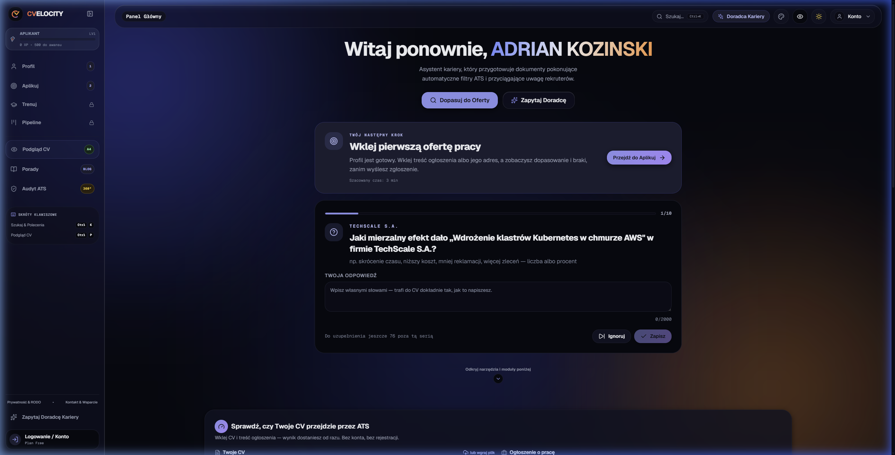
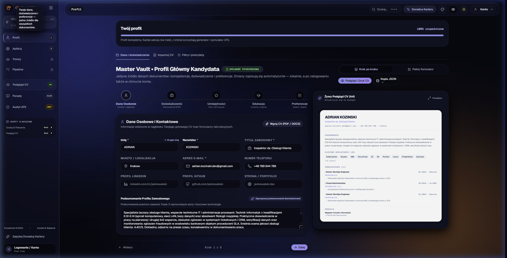
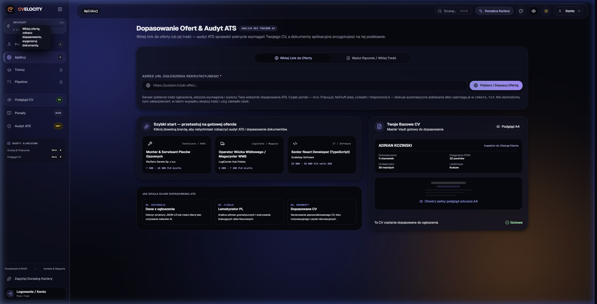
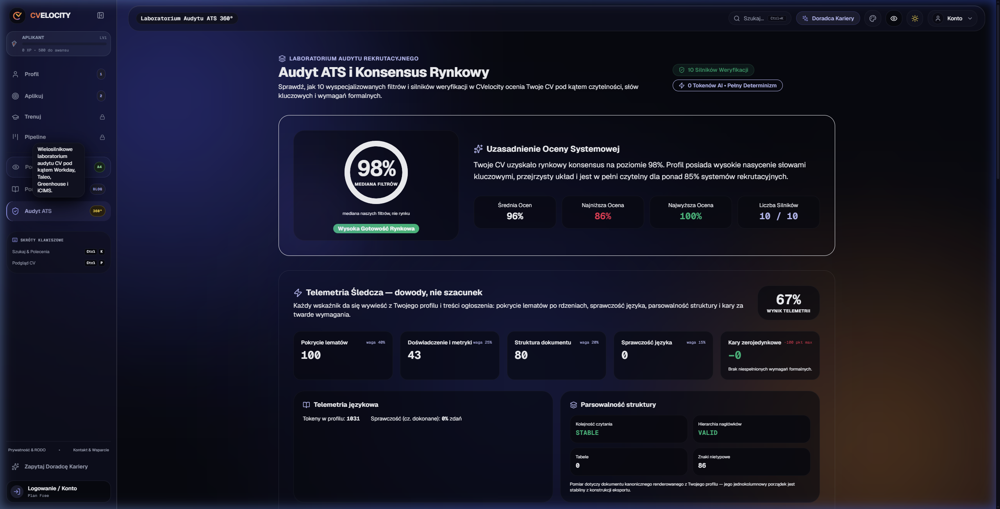
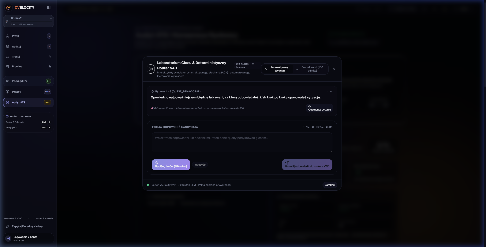
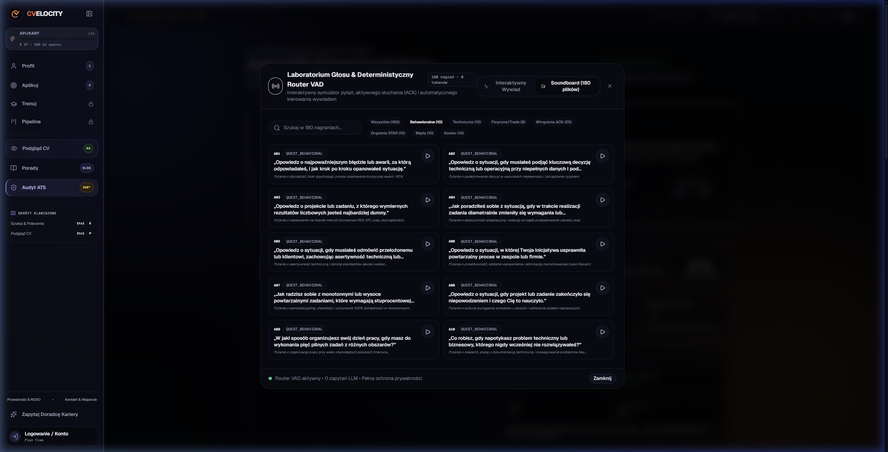
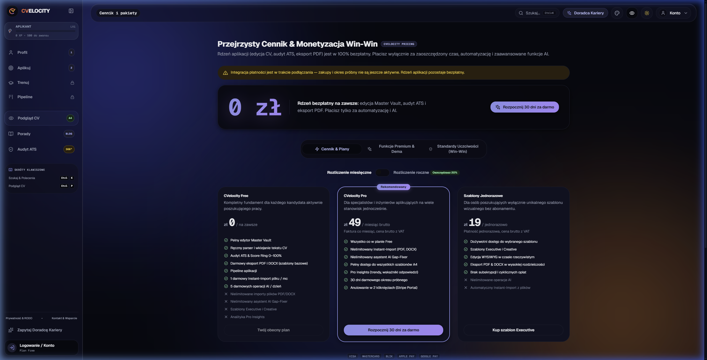

# CVelocity ⚡

> **Inteligentna Platforma Optymalizacji CV pod Polskie Filtry ATS, Deterministyczny Symulator Rozmów Rekrutacyjnych oraz Kalkulator Opłacalności Kariery.**

[](.github/workflows/ci.yml)
[-success.svg)](src/lib/__tests__)
[](tsconfig.json)
[](src/lib/recruiterAudio)
[](SECURITY.md)
[](docs/polityka-prywatnosci.md)

[**🌐 Wypróbuj Wersję Live (Wdrożenie Produkcyjne)**](https://cvelocity.oathcry.com/) • [**📖 Dokumentacja Architektury**](./SYSTEM_ARCHITECTURE_GUIDANCE.md) • [**🛡️ Model Zagrożeń & Bezpieczeństwo**](./SECURITY.md)

---

## 🎯 Dlaczego CVelocity?

Większość generatorów CV opartych na modelach językowych halucynuje: dopisuje kandydatom technologie, których nigdy nie widzieli, co kończy się kompromitacją na pierwszym pytaniu technicznym.

**CVelocity realizuje żelazną zasadę: ZERO WYMYŚLONYCH DANYCH.**
1. **Każdy fakt pochodzi od użytkownika** — aplikacja bada braki w strukturze (osiągnięcie bez liczby, obowiązek bez narzędzia) i dopytuje o nie przez zwięzły mikro-wywiad, zamiast konfabulować.
2. **Deterministyczny Router Głosu z VAD (0 tokenów)** — 180 wzorcowych nagrań audio rekrutera, aktywne wtrącenia ACK w locie (`> 2.0s`) i drążenie metodą STAR bez opóźnień i bez kosztów LLM.
3. **Potrójny Konsensus ATS 360°** — własny algorytm z polskim stemmerem, słownikiem stop-words i audytem kryteriów zerojedynkowych (SEP, UDT, F-Gaz, kat. prawa jazdy, certyfikaty).
4. **Kalkulator Dojazdów & Relacji Geograficznych** — baza 13 000+ miejscowości w Polsce ze szacowaniem odległości, czasu dojazdu i realnego zysku netto z oferty.

---

## 📸 Prezentacja Wizualna i Funkcje

### 1. Pulpit Główny & Rekomendacja Następnego Kroku (`NextActionCard`)
Intuicyjny kokpit prowadzący kandydata krok po kroku od importu dokumentu po finalną aplikację.


---

### 2. Master Vault — Pojedyncze Źródło Prawdy o Twojej Karierze
Edytor profilu kompetencji, historii zatrudnienia, twardych metryk liczbowych oraz uprawnień formalnych (BHP, SEP, UDT, F-Gaz).


---

### 3. Dopasowanie do Oferty & Matcher ATS (`JobMatcher`)
Skaner ogłoszeń o pracę (`schema.org/JobPosting`), analiza brakujących słów kluczowych i automatyczne generowanie pytań uzupełniających.


---

### 4. Laboratorium Konsensusu ATS 360° (`AtsLabView`)
Wielosilnikowy audyt zgodności dokumentu z systemami ATS (parser struktury, scoring słów kluczowych, telemetria śledcza i konsensus odporności).


---

### 5. Laboratorium Głosu & Deterministyczny Router VAD (180 Nagrań)
Interaktywny symulator odpowiedzi z dyktowaniem na żywo, analizą aktywności głosu (VAD) i natychmiastowym routingiem pytań rekrutera.


---

### 6. Soundboard Rekrutera (180 Plików Audio)
Przeglądarka i odtwarzacz 15 kategorii nagrań rekrutacyjnych: pytania STAR, techniczne, branżowe/trade, wtrącenia ACK, drążenie i barge-in.


---

### 7. Przejrzyste Pakiety & Transparentny Model (`PricingView`)
Dostęp do narzędzia w trybie 100% lokalnym (bezpłatnym) oraz opcjonalne pakiety chmurowe i zaawansowane audyty.


---

## 🏗️ Główne Silniki i Architektura (`src/lib/`)

```
src/lib/
├── recruiterAudio/        # Baza 180 nagrań MP3 + Deterministyczny Router VAD (ACK, STAR, TRS, ERR)
├── interviewQuestions/    # 35 wzorcowych pytań STAR/Trade + 25 pytań z pauzą na tokeny
├── geoDistance/           # Silnik odległości i relacji miejscowości w Polsce (13 000+ miast)
├── experienceEngine/      # Drzewo profesji i mikro-wywiad doświadczeń zawodowych
├── atsScorer.ts           # Stemmer języka polskiego, wagi fraz, scoring ATS
├── atsConsensusEngine.ts  # Konsensus 3 silników oceny dopasowania do oferty
├── skillBridgeEngine.ts   # Mosty kompetencyjne (zamiana luk w atuty na rozmowie)
├── elevatorPitchEngine.ts # 3 warianty autoprezentacji (1-liner, 30s, 90s)
├── layeredVaultEngine.ts  # Warstwy uprawnień i agregacja profilu
└── docxExporter.ts        # Generator natywnych plików DOCX i PDF (format A4)
```

---

## 🔒 Prywatność i Bezpieczeństwo Danych

| Kategoria | Standard w CVelocity |
| :--- | :--- |
| **Ciasteczka & Śledzenie** | **Brak.** Zero skryptów śledzących, zero ciasteczek analitycznych. |
| **Tryb Lokalny** | Dane nie opuszczają Twojej przeglądarki (`localStorage` z sumą kontrolną CRC). |
| **Granica Danych Osobowych** | Model AI nigdy nie widzi PII (`photoUrl`, telefon, e-mail, nazwisko są usuwane / pseudonimizowane). |
| **Czcionki** | Hostowane lokalnie (`public/fonts`), zero wywołań do Google Fonts. |
| **Bezpieczeństwo Bazy** | Baza Supabase Postgres (Frankfurt) z rygorystycznymi regułami **Row Level Security (RLS)**. |

---

## 🚀 Szybki Start (Lokalne Uruchomienie)

### Wymagania:
- **Node.js**: >= 20.x
- **NPM**: >= 10.x

### Instalacja i uruchomienie serwera:

```bash
# 1. Sklonuj repozytorium
git clone https://github.com/krymszuch-stack/cvelocity.git
cd cvelocity

# 2. Zainstaluj zależności
npm install

# 3. Skonfiguruj środowisko
cp .env.example .env

# 4. Uruchom serwer deweloperski
npm run dev
```

Aplikacja będzie dostępna pod adresem: `http://localhost:5173/` (lub `http://localhost:3000/` w trybie pełnego serwera express).

---

## 🧪 Jakość Kodu i Testy

Projekt utrzymuje rygorystyczną bramkę jakościową — 100% testów przechodzi w środowisku Node:

```bash
# Uruchomienie wszystkich 813 testów jednostkowych
npm test

# Sprawdzenie typów TypeScript i reguł ESLint
npm run lint

# Budowa produkcyjna aplikacji (klient Vite + serwer esbuild)
npm run build
```

---

## 📜 Licencja i Prawa Autorskie

Projekt stworzony i rozwijany przez zespół **CVelocity**.  
Wszelkie prawa zastrzeżone. Znaki towarowe (Luxmed, PZU, MultiSport, Pracuj.pl itp.) należą do ich prawnych właścicieli i zostały użyte wyłącznie w celach informacyjno-identyfikacyjnych.
